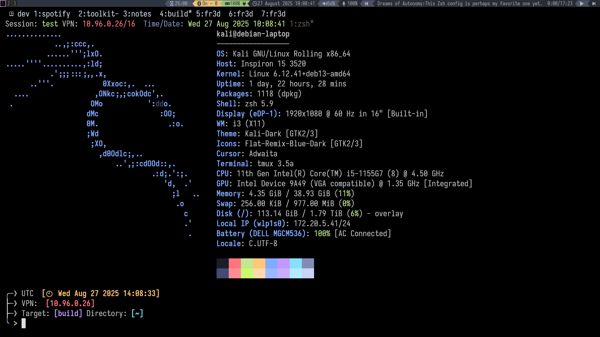

# Security Research Container Toolkit


 

> **SCRT** — a disposable, flexible, and repeatable container environment for security researchers, analysts, and enthusiasts.

---

`SCRT` is a containerized security research environment designed for offensive and defensive operations.

Whether it's recon, exploitation, log analysis, or tool testing, `scrt` gives you consistent environments every time. Avoid dependency hell and save countless hours configuring the host OS. `scrt` runs locally, in the cloud or even kubernetes if you're
feeling frisky

\*\*> [!NOTE]

> container image has not been tested on K8s.

---

## Features



- [ ] Lightweight kali base image with opinionated tool selection

- [ ] Pick up where you left off with persistent containers, volumes and workspaces

- [ ] Custom Starship prompt with comfortable context for any engagement &
      pre-configured Tmux configuration with informative status line

- [ ] GUI apps such as Burpsuite, Mousepad, SQLiteViewer, & Wireshark can be launched from inside the container (remote servers require enabling X11 forwarding)

- [ ] Firefox comes pre-configured with bookmarks, FoxyProxy
      & Cookie Modifier Extensions

- [ ] Useful commands are already built into the container history. Simple type `CTRL+r' to pull up the fzf window and filter for commands. fzf makes navigating commands and files a breeze.

---

##  How to run `scrt`

### Dependencies

- Docker
- Bash or ZSH

---

```bash
USAGE:
  scrt <command> [arguments]

COMMANDS:
  start <project> [image]     - Start a new container
  enter <project>             - Enter a running container
  stop <project>              - Stop a container
  destroy <project> [--force] - Destroy container and data
  backup <project> [dir]      - Backup project data
  pull  [dev, latest, <tag>]  - Pull/update image
  dev                         - Pull development image
  list                        - List all containers
  config                      - Create configuration file
  help                        - Show this help

EXAMPLES:
  scrt start myproject
  scrt start myproject fonalex45/gr3ysh3ll:dev
  scrt backup myproject ./my-backups
  scrt destroy myproject --force

CONFIGURATION:
  Configuration file: /home/fr3d/.scrt.conf
  Run 'scrt config' to create a configuration file

ENVIRONMENT VARIABLES:
  NAME          - Project/Lab/Engagement name
  TARGET        - Name of target or engagement alias
  DOMAIN        - Target domain name
  USER          - Target user
  IP            - Target IP Address (mostly for lab environments/ CTFs)
  SCRT_TAG    - Docker image tag (latest by default)
  SCRT_SHELL    - Shell to use inside container
  SCRT_HOST_NET - Enable host networking (true/false)
  SCRT_X11      - Enable X11 forwarding (true/false)
  SCRT_GPU      - Enable GPU support (true/false)
  SCRT_CAPS     - Additional capabilities (comma-separated)
  SCRT_MOUNTS   - Extra mounts (comma-separated)
  SCRT_WORKDIR  - Base working directory

```

### Custom aliases included

---

```bash
#daily use
alias c='clear'
alias t='tmux new -f ~/.tmux.conf -s $1'
alias i='sudo apt install -y'
alias q='exit'
alias r='. ~/.zshrc'
alias v='nvim'
alias update='sudo apt update'
alias upgrade='sudo apt upgrade'
alias get="curl -O -L"
alias cat='batcat'
alias weather='curl https://wttr.in'
alias public='curl wtfismyip.com/text'
alias download='aria2c'
alias home='cd ~'

#pentesting aliases
alias cme='nxc'
alias port-scan='sudo nmap -sC -sV -p- $IP > scan.txt'
alias udp-scan='sudo nmap -sU --top-ports 10 $IP -v > udp.scan.txt'
alias stealth-scan='sudo nmap --data-length 6 -T3 -A -ttl 64 -p- $IP > stealth-scan.txt'
alias proxy='proxychains'
alias serve='sudo python3 -m http.server 8888'
alias notepad='mousepad notes.md > /dev/null 2>&1 &'
#python3
alias py-virt='python3 -m venv .venv && source .venv/bin/activate'
alias freeze='pip freeze > requirements.txt'
alias py-install='pip install -r requirements.txt'
alias py-list='pipx list | grep package'

```
